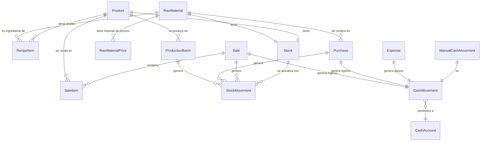

# DER - Diagrama de Entidad-Relación para MongoDB

Modelo de datos diseñado para MongoDB, considerando las User Stories y el POC del sistema Kelas.

---

## Diagrama de Relaciones



---

## Colecciones (Collections)

### 1. `rawMaterials` — Materias Primas

```json
{
  "_id": "ObjectId",
  "name": "String (unique, required)",
  "unit": "String (required) — gr | kg | ml | lt | unidad | cm",
  "lastPricePerUnit": "Number (default: 0) — último precio por unidad, se actualiza con cada compra",
  "minStock": "Number (default: 0) — alerta de stock mínimo",
  "isActive": "Boolean (default: true)",
  "createdAt": "Date",
  "updatedAt": "Date"
}
```

**Índices:**
- `{ name: 1 }` — unique
- `{ unit: 1 }`
- `{ isActive: 1 }`

---

### 2. `products` — Productos Terminados

```json
{
  "_id": "ObjectId",
  "name": "String (unique, required)",
  "description": "String",
  "listPrice": "Number (required) — precio de lista en $",
  "estimatedHours": "Number — horas estimadas de producción",
  "minMargin": "Number — margen mínimo % (ej: 40)",
  "recipe": [
    {
      "rawMaterialId": "ObjectId (ref: rawMaterials)",
      "quantity": "Number (required) — cantidad por unidad de producto"
    }
  ],
  "isVisible": "Boolean (default: true)",
  "createdAt": "Date",
  "updatedAt": "Date"
}
```

**Índices:**
- `{ name: 1 }` — unique
- `{ isVisible: 1 }`
- `{ "recipe.rawMaterialId": 1 }`

**Nota:** La receta se embebe como subdocumento dentro del producto (patrón de embedding en MongoDB) porque siempre se consulta junto con el producto y no tiene vida independiente.

---

### 3. `stock` — Saldo Actual de Stock

```json
{
  "_id": "ObjectId",
  "itemType": "String (required) — 'RawMaterial' | 'FinishedProduct'",
  "itemId": "ObjectId (required) — ref a rawMaterials o products",
  "currentQuantity": "Number (required, default: 0)",
  "lastUpdated": "Date"
}
```

**Índices:**
- `{ itemType: 1, itemId: 1 }` — unique compound
- `{ currentQuantity: 1 }`

---

### 4. `stockMovements` — Historial de Movimientos de Stock

```json
{
  "_id": "ObjectId",
  "itemType": "String (required) — 'RawMaterial' | 'FinishedProduct'",
  "itemId": "ObjectId (required) — ref a rawMaterials o products",
  "movementType": "String (required) — ver enum abajo",
  "quantity": "Number (required) — positivo = ingreso, negativo = egreso",
  "date": "Date (required)",
  "referenceType": "String (optional) — 'Purchase' | 'Production' | 'Sale' | null (para ajustes)",
  "referenceId": "ObjectId (optional) — ref a la entidad origen (null para ajustes)",
  "adjustmentReason": "String (optional) — solo para ajustes: 'Vencimiento' | 'Rotura' | 'Pérdida' | 'Corrección de inventario' | 'Otro'",
  "notes": "String (optional)",
  "createdAt": "Date"
}
```

**Enum `movementType`:**
- `PurchaseEntry` — ingreso por compra de MP
- `ProductionConsumption` — egreso por consumo en producción
- `ProductionOutput` — ingreso por producción de producto terminado
- `SaleOutput` — egreso por venta
- `AdjustmentIncrease` — ajuste positivo
- `AdjustmentDecrease` — ajuste negativo

**Índices:**
- `{ itemType: 1, itemId: 1, date: -1 }`
- `{ referenceType: 1, referenceId: 1 }`
- `{ movementType: 1 }`
- `{ date: -1 }`

**Regla:** Los documentos de esta colección son **inmutables** (nunca se editan ni eliminan).

---

### 5. `rawMaterialPrices` — Historial de Precios de Materias Primas (Auditoría)

```json
{
  "_id": "ObjectId",
  "rawMaterialId": "ObjectId (required, ref: rawMaterials)",
  "pricePerUnit": "Number (required) — precio por unidad de medida",
  "dateFrom": "Date (required) — fecha desde la cual aplica",
  "purchaseId": "ObjectId (ref: purchases) — compra que originó este precio",
  "createdAt": "Date"
}
```

**Índices:**
- `{ rawMaterialId: 1, dateFrom: -1 }`

**Nota:** Esta colección es solo para auditoría/consulta de evolución de precios. El precio operativo que se usa para calcular costos es `rawMaterials.lastPricePerUnit`.

---

### 6. `purchases` — Compras de Materia Prima

```json
{
  "_id": "ObjectId",
  "rawMaterialId": "ObjectId (required, ref: rawMaterials)",
  "quantity": "Number (required, > 0)",
  "totalPrice": "Number (required, > 0) — precio total de la compra",
  "pricePerUnit": "Number (calculated) — totalPrice / quantity",
  "date": "Date (required)",
  "supplier": "String (optional)",
  "cashAccountId": "ObjectId (required, ref: cashAccounts)",
  "notes": "String (optional)",
  "createdAt": "Date"
}
```

**Índices:**
- `{ rawMaterialId: 1, date: -1 }`
- `{ date: -1 }`
- `{ cashAccountId: 1 }`

---

### 7. `productionBatches` — Tandas de Producción

```json
{
  "_id": "ObjectId",
  "productId": "ObjectId (required, ref: products)",
  "quantity": "Number (required, > 0) — unidades producidas",
  "date": "Date (required)",
  "totalCost": "Number (required) — costo total de la tanda",
  "unitCost": "Number (required) — totalCost / quantity",
  "ingredients": [
    {
      "rawMaterialId": "ObjectId (ref: rawMaterials)",
      "quantityUsed": "Number — cantidad total consumida",
      "pricePerUnit": "Number — precio vigente al momento",
      "cost": "Number — quantityUsed × pricePerUnit"
    }
  ],
  "notes": "String (optional)",
  "createdAt": "Date"
}
```

**Índices:**
- `{ productId: 1, date: -1 }`
- `{ date: -1 }`

**Nota:** Los `ingredients` se embeben como snapshot del momento de producción (desnormalización intencional para preservar el costo histórico exacto).

---

### 8. `sales` — Ventas

```json
{
  "_id": "ObjectId",
  "date": "Date (required)",
  "channel": "String (required) — 'Feria' | 'Instagram' | 'Tienda' | 'Otro'",
  "paymentMethod": "String (required) — 'Efectivo' | 'Transferencia' | 'Mercado Pago'",
  "cashAccountId": "ObjectId (required, ref: cashAccounts)",
  "items": [
    {
      "productId": "ObjectId (ref: products)",
      "quantity": "Number (required, > 0)",
      "unitPrice": "Number (required) — precio unitario al momento de la venta",
      "subtotal": "Number — quantity × unitPrice",
      "unitCost": "Number — costo unitario de producción (COGS)",
      "cogs": "Number — quantity × unitCost"
    }
  ],
  "subtotal": "Number — suma de subtotales de ítems",
  "shipping": "Number (default: 0) — monto fijo de envío en $",
  "taxableBase": "Number — subtotal + shipping",
  "discountPercent": "Number (default: 0) — % de descuento",
  "discountAmount": "Number — taxableBase × discountPercent / 100",
  "grossIncome": "Number — taxableBase - discountAmount",
  "taxCostPercent": "Number (default: 0) — % costo impositivo",
  "taxCostAmount": "Number — taxableBase × taxCostPercent / 100",
  "channelCostPercent": "Number (default: 0) — % costo de canal",
  "channelCostAmount": "Number — taxableBase × channelCostPercent / 100",
  "totalCogs": "Number — suma de cogs de todos los ítems",
  "grossProfit": "Number — grossIncome - totalCogs",
  "netProfit": "Number — grossProfit - taxCostAmount - channelCostAmount",
  "notes": "String (optional)",
  "createdAt": "Date"
}
```

**Índices:**
- `{ date: -1 }`
- `{ channel: 1, date: -1 }`
- `{ paymentMethod: 1 }`
- `{ "items.productId": 1 }`
- `{ cashAccountId: 1 }`

**Nota:** Los ítems se embeben dentro de la venta (siempre se consultan juntos). El `unitPrice` y `unitCost` se guardan como snapshot al momento de la venta.

---

### 9. `expenses` — Gastos Operativos

```json
{
  "_id": "ObjectId",
  "date": "Date (required)",
  "amount": "Number (required, > 0)",
  "category": "String (required) — 'Marketing' | 'Packaging' | 'Envíos' | 'Alquiler' | 'Servicios' | 'Herramientas' | 'Otro'",
  "description": "String (required)",
  "cashAccountId": "ObjectId (required, ref: cashAccounts)",
  "notes": "String (optional)",
  "createdAt": "Date"
}
```

**Índices:**
- `{ date: -1 }`
- `{ category: 1, date: -1 }`
- `{ cashAccountId: 1 }`

---

### 10. `cashAccounts` — Cuentas de Caja

```json
{
  "_id": "ObjectId",
  "name": "String (unique, required) — 'Efectivo' | 'Banco' | 'Mercado Pago'",
  "currentBalance": "Number (default: 0)",
  "isActive": "Boolean (default: true)",
  "createdAt": "Date",
  "updatedAt": "Date"
}
```

**Índices:**
- `{ name: 1 }` — unique
- `{ isActive: 1 }`

---

### 11. `cashMovements` — Movimientos de Caja

```json
{
  "_id": "ObjectId",
  "cashAccountId": "ObjectId (required, ref: cashAccounts)",
  "type": "String (required) — 'income' | 'expense'",
  "concept": "String (required) — 'Venta' | 'Compra MP' | 'Gasto' | 'Aporte de capital' | 'Retiro de efectivo' | 'Transferencia' | 'Ajuste de saldo'",
  "amount": "Number (required) — siempre positivo, el signo lo da 'type'",
  "description": "String — texto descriptivo del movimiento",
  "date": "Date (required)",
  "origin": "String (required) — 'automatic' | 'manual'",
  "referenceType": "String (optional) — 'Sale' | 'Purchase' | 'Expense' | 'ManualMovement'",
  "referenceId": "ObjectId (optional) — ref a la entidad origen",
  "linkedMovementId": "ObjectId (optional) — para transferencias, ref al movimiento contrario",
  "createdAt": "Date"
}
```

**Índices:**
- `{ cashAccountId: 1, date: -1 }`
- `{ date: -1 }`
- `{ concept: 1 }`
- `{ type: 1 }`
- `{ referenceType: 1, referenceId: 1 }`
- `{ origin: 1 }`

**Regla:** Los movimientos de caja son **inmutables** (no se editan ni eliminan).

---

## Relaciones entre Colecciones

```
┌─────────────────────────────────────────────────────────────────────┐
│                        FLUJO DE DATOS                                │
├─────────────────────────────────────────────────────────────────────┤
│                                                                     │
│  rawMaterials ──┬── rawMaterialPrices (1:N) — auditoría de precios   │
│                 ├── purchases (1:N) ──── cashMovements (1:1)        │
│                 ├── stock (1:1)                                     │
│                 └── stockMovements (1:N)                            │
│                                                                     │
│  products ──────┬── productionBatches (1:N)                         │
│                 ├── stock (1:1)                                     │
│                 ├── stockMovements (1:N)                            │
│                 └── sales.items (embebido en ventas)                │
│                                                                     │
│  sales ─────────┬── cashMovements (1:1)                             │
│                 └── stockMovements (1:N)                            │
│                                                                     │
│  expenses ──────── cashMovements (1:1)                              │
│                                                                     │
│  cashAccounts ──── cashMovements (1:N)                              │
│                                                                     │
└─────────────────────────────────────────────────────────────────────┘
```

---

## Decisiones de Diseño para MongoDB

### Embedding vs Referencing

| Relación | Decisión | Justificación |
|---|---|---|
| Producto → Receta | **Embed** | La receta siempre se lee con el producto. No tiene vida independiente. |
| Producción → Ingredientes | **Embed** | Snapshot histórico. Siempre se lee junto con la tanda. |
| Venta → Ítems | **Embed** | Siempre se consultan juntos. No crecen indefinidamente. |
| MP → Precios | **Reference** | Solo para auditoría. El precio operativo vive en `rawMaterials.lastPricePerUnit`. |
| Cualquier entidad → StockMovements | **Reference** | Colección de alto volumen. Se consulta con filtros y paginación. |
| Cualquier entidad → CashMovements | **Reference** | Colección de alto volumen. Se consulta con filtros y paginación. |

### Desnormalización Intencional

- **`productionBatches.ingredients`**: Se guarda el precio por unidad al momento de producción (snapshot). El costo de la tanda queda fijo para siempre, no se recalcula si cambia el precio de la MP.
- **`sales.items.unitPrice`**: Se guarda el precio al momento de la venta (no el precio de lista actual).
- **`sales.items.unitCost`**: Se guarda el costo del producto al momento de la venta (calculado como receta × `lastPricePerUnit` de cada MP). Ese es el COGS que se usa en el dashboard.
- **`purchases.pricePerUnit`**: Se calcula y guarda al registrar la compra. Además actualiza `rawMaterials.lastPricePerUnit`.

### Campos Calculados Almacenados

Algunos campos se calculan al momento de crear el documento y se almacenan para evitar recálculos:
- `sales.grossIncome`, `sales.netProfit`, etc.
- `productionBatches.totalCost`, `productionBatches.unitCost`
- `purchases.pricePerUnit`

Esto es válido porque estos documentos son **inmutables** una vez creados.

---

## Validaciones a Nivel de Aplicación

| Regla | Colección | Validación |
|---|---|---|
| Nombre único | rawMaterials, products, cashAccounts | Índice unique |
| Stock no negativo (con advertencia) | stock | Lógica de aplicación |
| Cantidad > 0 | purchases, productionBatches, sales.items | Schema validation |
| Monto > 0 | expenses, cashMovements | Schema validation |
| Receta sin MP duplicada | products.recipe | Lógica de aplicación |
| Descuento ≤ 100% | sales | Schema validation |
| Movimientos inmutables | stockMovements, cashMovements | Sin endpoints de update/delete |

---

## Queries Frecuentes (para referencia de índices)

1. **Stock actual de una MP**: `stock.find({ itemType: 'RawMaterial', itemId: X })`
2. **Precio actual de MP**: `rawMaterials.findOne({ _id: X }, { lastPricePerUnit: 1 })`
3. **Historial de movimientos**: `stockMovements.find({ itemType: X, itemId: Y }).sort({ date: -1 })`
4. **Ventas del mes por canal**: `sales.find({ date: { $gte: inicio, $lte: fin }, channel: X })`
5. **Gastos por categoría**: `expenses.aggregate([{ $match: { date: rango } }, { $group: { _id: "$category", total: { $sum: "$amount" } } }])`
6. **Movimientos de caja por cuenta**: `cashMovements.find({ cashAccountId: X, date: rango }).sort({ date: -1 })`
7. **Costo actual de un producto**: Calcular sumando `recipe[i].quantity × rawMaterials[recipe[i].rawMaterialId].lastPricePerUnit` para cada ingrediente
