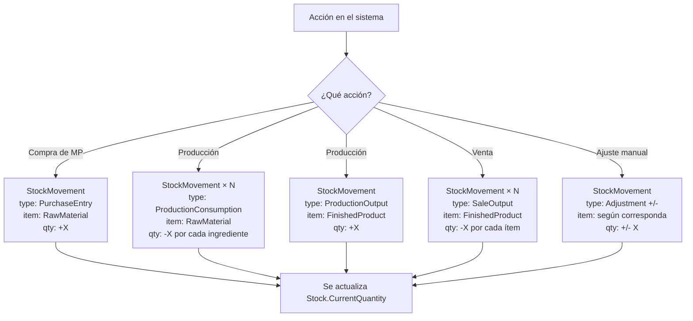
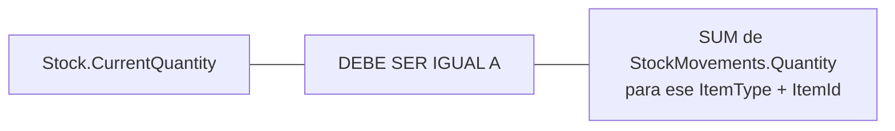
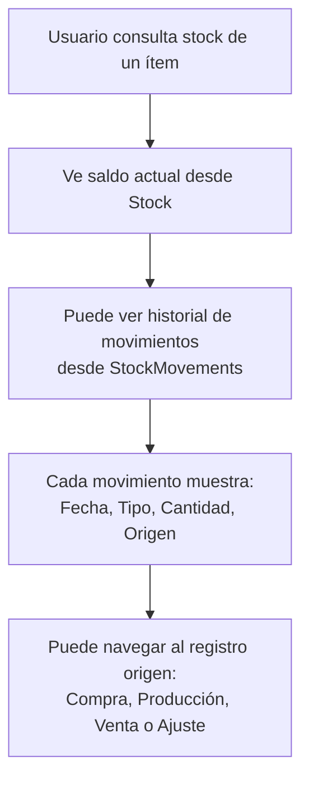

# Modelo de Stock y Trazabilidad

## Descripción

El sistema maneja dos niveles de stock para garantizar tanto consulta rápida como trazabilidad completa:

1. **Stock** → Saldo actual de cada ítem (consulta rápida).
2. **StockMovements** → Registro histórico de cada movimiento (trazabilidad).

Esto aplica tanto para Materias Primas como para Productos Terminados.

---

## Entidades

### Stock

Saldo actual. Se actualiza con cada movimiento.

| Campo | Descripción |
|---|---|
| `Id` | Identificador |
| `ItemType` | `RawMaterial` o `FinishedProduct` |
| `ItemId` | Id de la Materia Prima o Producto |
| `CurrentQuantity` | Saldo actual |
| `LastUpdated` | Fecha de última actualización |

### StockMovements

Registro de cada cambio de stock. Nunca se edita ni elimina.

| Campo | Descripción |
|---|---|
| `Id` | Identificador |
| `ItemType` | `RawMaterial` o `FinishedProduct` |
| `ItemId` | Id de la Materia Prima o Producto |
| `MovementType` | Tipo de movimiento (ver tabla abajo) |
| `Quantity` | Cantidad (positiva = ingreso, negativa = egreso) |
| `Date` | Fecha del movimiento |
| `ReferenceType` | Tipo de entidad origen (`Purchase`, `Production`, `Sale`, `Adjustment`) |
| `ReferenceId` | Id de la entidad origen |
| `Notes` | Notas opcionales |
| `CreatedAt` | Timestamp de creación |

### Tipos de Movimiento

| MovementType | ItemType | Quantity | Origen |
|---|---|---|---|
| `PurchaseEntry` | RawMaterial | + | Compra de MP |
| `ProductionConsumption` | RawMaterial | - | Producción (consumo de receta) |
| `ProductionOutput` | FinishedProduct | + | Producción (producto terminado) |
| `SaleOutput` | FinishedProduct | - | Venta |
| `AdjustmentIncrease` | Ambos | + | Ajuste manual (corrección, etc.) |
| `AdjustmentDecrease` | Ambos | - | Ajuste manual (vencimiento, rotura, pérdida) |

---

## Flujo General

## Principio de Consistencia

> Si en algún momento `Stock.CurrentQuantity` no coincide con la suma de `StockMovements`, hay un problema de integridad. Los `StockMovements` son la fuente de verdad.

---

## Consulta de Trazabilidad

### Ejemplo de Historial

> **Stock de Cera de Soja - Historial**
>
> | Fecha | Tipo | Cantidad | Saldo | Origen |
> |---|---|---|---|---|
> | 01/04 | PurchaseEntry | +1000gr | 1000gr | Compra #12 |
> | 05/04 | ProductionConsumption | -180gr | 820gr | Producción #8 |
> | 05/04 | ProductionConsumption | -180gr | 640gr | Producción #9 |
> | 15/04 | PurchaseEntry | +2000gr | 2640gr | Compra #15 |
> | 20/04 | ProductionConsumption | -900gr | 1740gr | Producción #12 |
> | 25/04 | AdjustmentDecrease | -200gr | 1540gr | Ajuste: Vencimiento |
>
> **Saldo actual: 1540gr** ✓ (coincide con suma de movimientos)

---

## Reglas de Negocio

- Todo cambio de stock genera un `StockMovement`. Sin excepción.
- Los `StockMovements` son inmutables (no se editan ni eliminan).
- `Stock.CurrentQuantity` se actualiza en cada movimiento.
- `StockMovements` es la fuente de verdad; `Stock` es una vista optimizada.
- Se puede recalcular `Stock.CurrentQuantity` sumando todos los `StockMovements` (reconciliación).
- Cada `StockMovement` tiene referencia al origen para navegación y auditoría.
