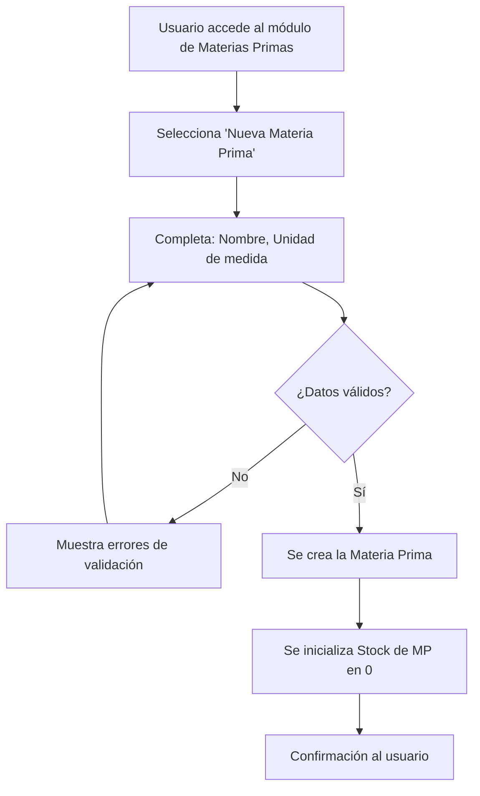
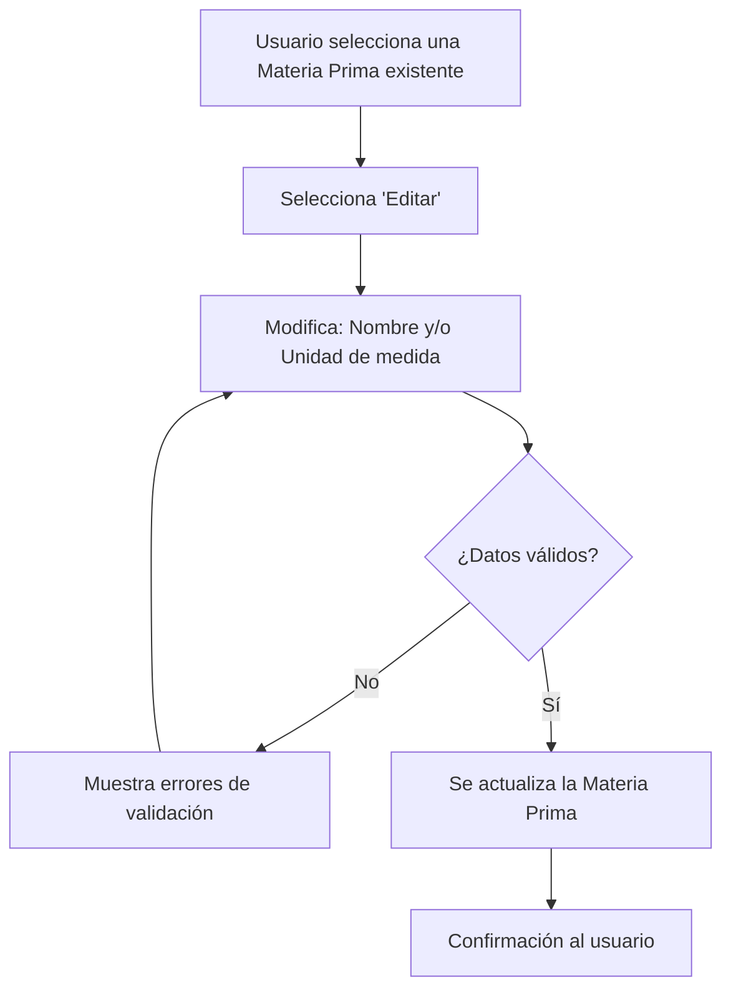
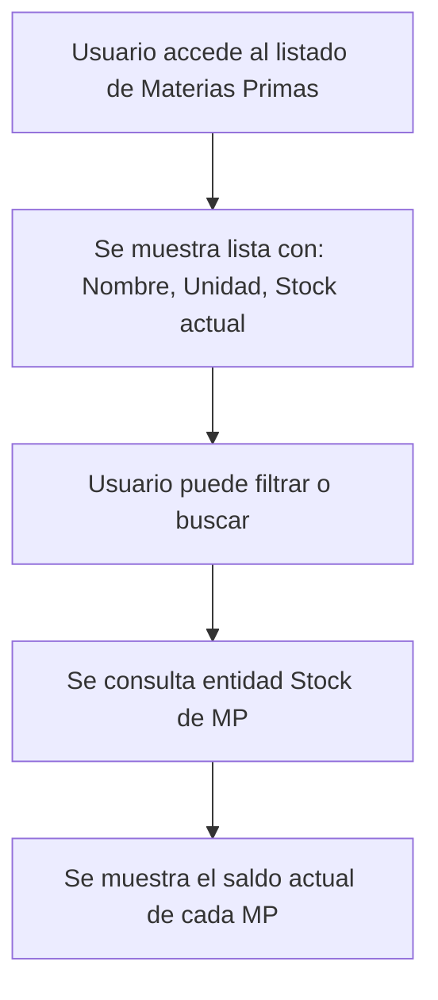

# Historia de Usuario 1: Gestión de Materias Primas

## Descripción

Permite dar de alta, editar y consultar materias primas y su stock actual.

## Actores

- Usuario (dueño/operador del negocio)

## Precondiciones

- Ninguna (es el punto de partida del sistema)

## Flujos

### 1a. Alta de Materia Prima

### 1b. Edición de Materia Prima

### 1c. Consulta de Stock de Materia Prima

## Reglas de Negocio

- El nombre de la materia prima debe ser único.
- La unidad de medida es obligatoria (gr, kg, ml, lt, unidad, etc.).
- Al crear una MP, su stock inicial es 0.
- No se puede eliminar una MP que tenga stock > 0 o esté referenciada en recetas.

## Entidades Involucradas

| Entidad | Acción |
|---|---|
| Materia Prima | Crear / Editar / Consultar |
| Stock de MP | Inicializar en 0 al crear MP |
