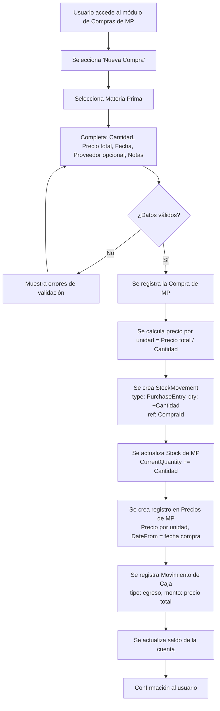
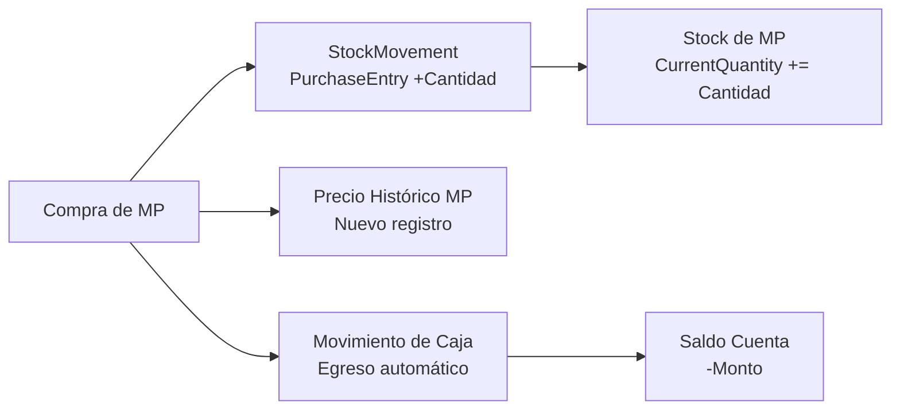

# Historia de Usuario 2: Compra de Materia Prima

## Descripción

Registra la compra de materia prima, actualizando stock, caja y precio histórico.

## Actores

- Usuario (dueño/operador del negocio)

## Precondiciones

- La materia prima debe existir en el sistema.
- Debe existir al menos una cuenta de caja.

## Flujo Principal

## Diagrama de Impacto en Entidades

## Ejemplo Concreto

> Se compra 1kg de Cera de Soja a $5.000.
>
> 1. Se registra compra: Cera de Soja, 1000gr, $5.000, 28/04/2026.
> 2. Stock de Cera de Soja: +1000gr.
> 3. Precio histórico: $5 por gr desde 28/04/2026.
> 4. Caja (Efectivo): egreso de $5.000.
> 5. Saldo Efectivo se reduce en $5.000.

## Reglas de Negocio

- La cantidad debe ser > 0.
- El precio total debe ser > 0.
- El precio por unidad se calcula automáticamente (precio total / cantidad).
- El nuevo precio histórico no reemplaza los anteriores, se agrega con fecha.
- El movimiento de caja se genera automáticamente (no manual).
- Se debe seleccionar desde qué cuenta se paga.

## Entidades Involucradas

| Entidad | Acción |
|---|---|
| Compra de MP | Crear |
| Stock de MP | Actualizar (+cantidad) |
| StockMovement | Crear (PurchaseEntry, ref: CompraId) |
| Precio Histórico MP | Crear nuevo registro |
| Movimiento de Caja | Crear (egreso automático) |
| Cuenta de Caja | Actualizar saldo (-monto) |
