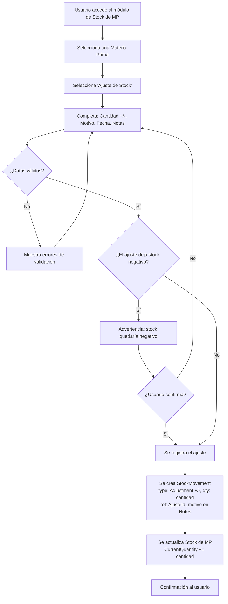
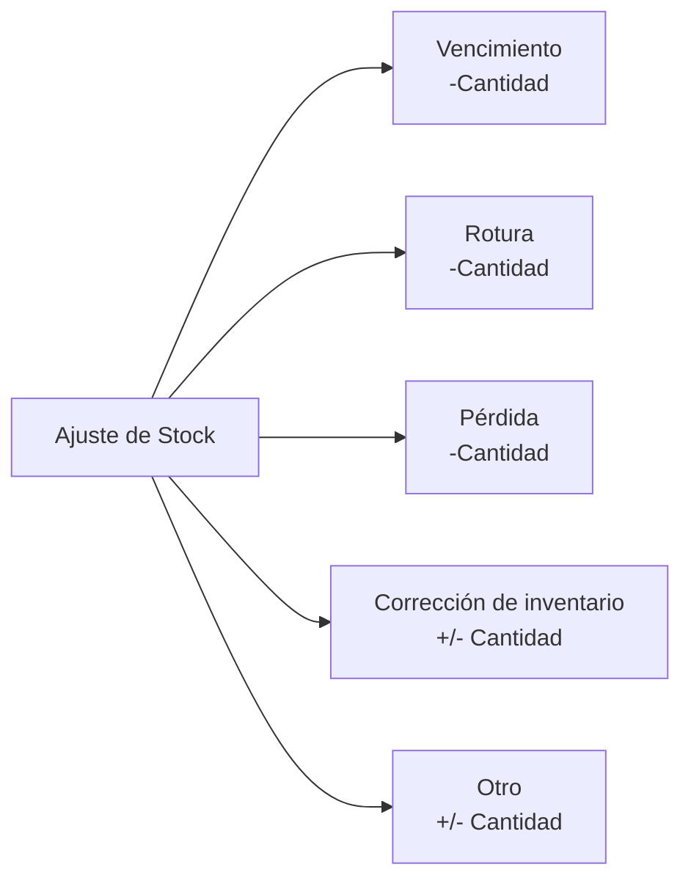

# Historia de Usuario 3: Ajuste de Stock de Materia Prima

## Descripción

Permite registrar ajustes manuales de stock de materia prima por motivos no comerciales: vencimiento, rotura, pérdida, corrección de inventario, etc.

## Actores

- Usuario (dueño/operador del negocio)

## Precondiciones

- La materia prima debe existir en el sistema.
- Debe tener stock registrado (puede ser 0).

## Flujo Principal

## Tipos de Ajuste

## Ejemplo Concreto

> Se detecta que 200gr de Fragancia Vainilla vencieron.
>
> 1. Se selecciona Fragancia Vainilla.
> 2. Ajuste: -200gr, motivo: Vencimiento, fecha: 28/04/2026.
> 3. Stock de Fragancia Vainilla se reduce en 200gr.
> 4. No se genera movimiento de caja.

## Reglas de Negocio

- La cantidad puede ser positiva (corrección a favor) o negativa (baja).
- El motivo es obligatorio.
- No genera movimiento de caja (es ajuste físico, no monetario).
- Se permite stock negativo con advertencia (para corregir después).
- Queda registro histórico de todos los ajustes.

## Entidades Involucradas

| Entidad | Acción |
|---|---|
| Stock de MP | Actualizar (+/- cantidad) |
| StockMovement | Crear (AdjustmentIncrease o AdjustmentDecrease, ref: AjusteId) |
