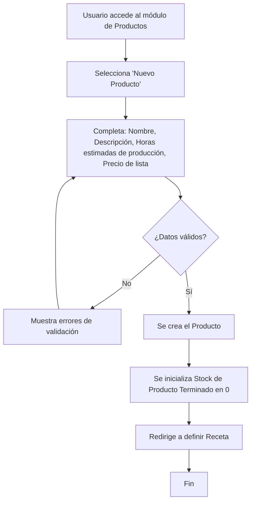
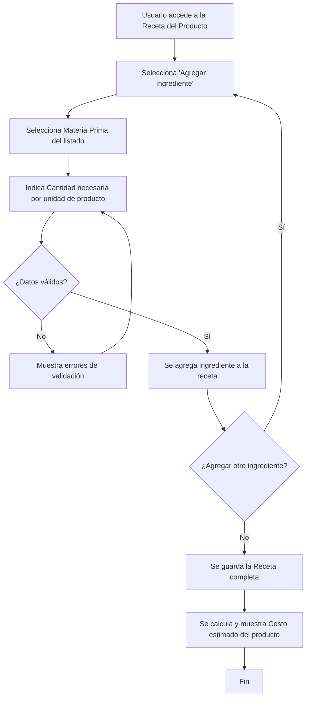
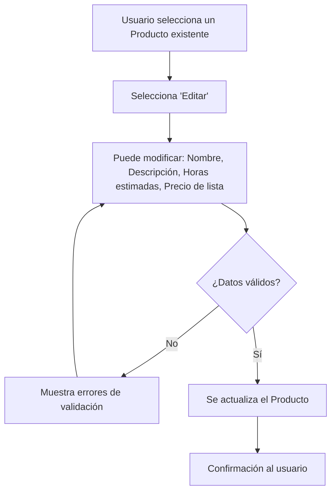
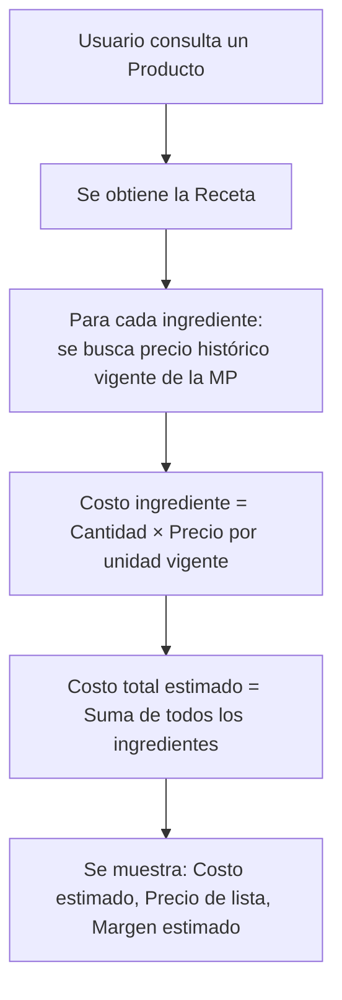

# Historia de Usuario 4: Gestión de Productos

## Descripción

Permite crear, editar y consultar productos terminados, incluyendo su receta y precio de lista.

## Actores

- Usuario (dueño/operador del negocio)

## Precondiciones

- Para definir receta: las materias primas referenciadas deben existir.

## Flujos

### 4a. Alta de Producto

### 4b. Definición de Receta

### 4c. Edición de Producto

### 4d. Consulta de Costo Estimado

## Ejemplo Concreto

> Se crea el producto "Vela Aromática Vainilla 200gr".
>
> 1. Nombre: Vela Aromática Vainilla 200gr
> 2. Descripción: Vela de cera de soja con fragancia vainilla
> 3. Horas estimadas: 1.5h
> 4. Precio de lista: $3.500
> 5. Receta:
>    - Cera de Soja: 180gr
>    - Fragancia Vainilla: 20gr
>    - Mecha: 1 unidad
>    - Frasco: 1 unidad
> 6. Costo estimado (según precios vigentes): $1.800
> 7. Margen estimado: $1.700 (48.6%)

## Reglas de Negocio

- El nombre del producto debe ser único.
- El precio de lista es de referencia (se puede modificar al vender).
- La receta puede tener uno o más ingredientes.
- Una misma MP no puede aparecer dos veces en la misma receta.
- El costo estimado se recalcula dinámicamente según precios vigentes de MP.
- No se puede eliminar un producto que tenga stock > 0 o ventas/producciones asociadas.
- La tabla de productos permite ordenar por cualquier columna (click en encabezado para alternar ascendente/descendente).

## Entidades Involucradas

| Entidad | Acción |
|---|---|
| Producto | Crear / Editar / Consultar |
| Receta (sub-entidad de Producto) | Crear / Editar |
| Stock de Producto Terminado | Inicializar en 0 al crear producto |
| Precio Histórico MP | Consultar (para costo estimado) |
