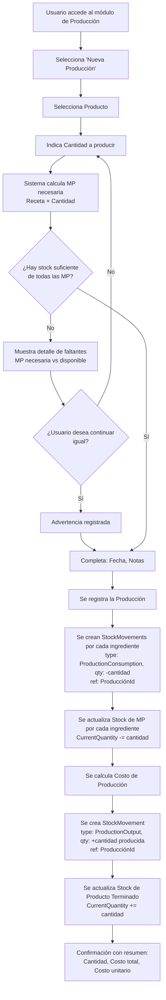
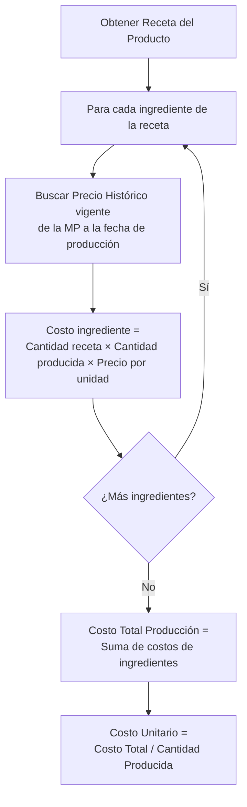

# Historia de Usuario 5: Producción

## Descripción

Registra una tanda de producción de un producto, descontando materia prima del stock, calculando el costo de producción y generando stock de producto terminado.

## Actores

- Usuario (dueño/operador del negocio)

## Precondiciones

- El producto debe existir y tener receta definida.
- Debe haber stock suficiente de todas las materias primas de la receta.

## Flujo Principal

## Cálculo de Costo de Producción

## Ejemplo Concreto

> Se producen 10 unidades de "Vela Aromática Vainilla 200gr".
>
> **Receta por unidad:**
> - Cera de Soja: 180gr
> - Fragancia Vainilla: 20gr
> - Mecha: 1 unidad
> - Frasco: 1 unidad
>
> **Para 10 unidades se necesita:**
> - Cera de Soja: 1800gr → se descuenta del stock
> - Fragancia Vainilla: 200gr → se descuenta del stock
> - Mecha: 10 unidades → se descuenta del stock
> - Frasco: 10 unidades → se descuenta del stock
>
> **Cálculo de costo (precios vigentes):**
> - Cera de Soja: 1800gr × $5/gr = $9.000
> - Fragancia Vainilla: 200gr × $15/gr = $3.000
> - Mecha: 10 × $200 = $2.000
> - Frasco: 10 × $500 = $5.000
> - **Costo total: $19.000**
> - **Costo unitario: $1.900**
>
> **Resultado:**
> - Stock Vela Aromática Vainilla: +10 unidades
> - Costo registrado en la tanda: $19.000

## Reglas de Negocio

- La cantidad a producir debe ser > 0.
- Se permite producir con stock insuficiente de MP (con advertencia), para cubrir casos donde el stock no está actualizado.
- El costo se calcula con el precio histórico vigente a la fecha de producción.
- El costo de producción queda asociado a la tanda (para calcular COGS después).
- No genera movimiento de caja (la plata ya salió en la compra de MP).
- Cada tanda queda registrada individualmente para trazabilidad.

## Entidades Involucradas

| Entidad | Acción |
|---|---|
| Producción | Crear |
| Producto / Receta | Consultar |
| Stock de MP | Actualizar (-cantidad por cada ingrediente) |
| StockMovement (MP) | Crear N registros (ProductionConsumption, ref: ProducciónId) |
| Precio Histórico MP | Consultar (para cálculo de costo) |
| Stock de Producto Terminado | Actualizar (+cantidad producida) |
| StockMovement (PT) | Crear (ProductionOutput, ref: ProducciónId) |
