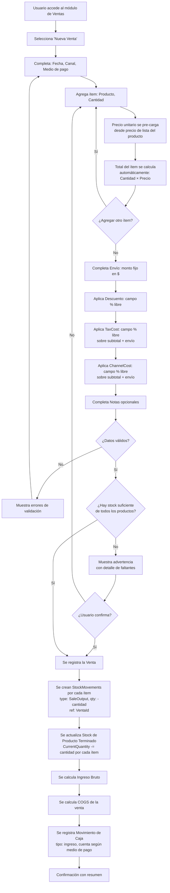
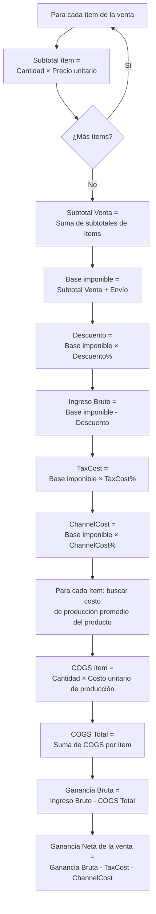

# Historia de Usuario 6: Venta

## Descripción

Registra una venta de uno o más productos, descontando stock de producto terminado, calculando ingresos, COGS, costos impositivos y costos de canal, y generando movimiento de caja.

## Actores

- Usuario (dueño/operador del negocio)

## Precondiciones

- Los productos vendidos deben existir.
- Debe haber stock de producto terminado (se advierte si no hay suficiente).
- Debe existir al menos una cuenta de caja.

## Flujo Principal

## Cálculo de Ingreso, COGS y Costos Asociados

## Ejemplo Concreto

> Venta en feria del 28/04/2026:
>
> **Ítems:**
> - 2x Vela Aromática Vainilla 200gr @ $3.500 = $7.000
> - 1x Vela Aromática Lavanda 150gr @ $2.800 = $2.800
>
> **Envío:** $0
> **Subtotal + Envío (Base imponible):** $9.800
> **Descuento:** 5% → $490
> **TaxCost:** 0%
> **ChannelCost:** 10% → $980 (alquiler de puesto prorrateado)
>
> **Cálculos:**
> - Ingreso Bruto: $9.800 - $490 = $9.310
> - COGS: (2 × $1.900) + (1 × $1.400) = $5.200
> - Ganancia Bruta: $9.310 - $5.200 = $4.110
> - Ganancia Neta de la venta: $4.110 - $0 - $980 = $3.130
>
> **Impacto:**
> - Stock Vela Vainilla: -2 unidades
> - Stock Vela Lavanda: -1 unidad
> - Caja (Efectivo): ingreso de $9.310
> - Canal: Feria
> - Medio de pago: Efectivo

### Ejemplo con venta por Instagram (con envío, comisiones e impuestos)

> Venta por Instagram del 25/04/2026:
>
> **Ítems:**
> - 3x Vela Aromática Vainilla 200gr @ $3.500 = $10.500
>
> **Envío:** $1.200
> **Subtotal + Envío (Base imponible):** $11.700
> **Descuento:** 0%
> **TaxCost:** 6% → $702 (retención MP)
> **ChannelCost:** 5% → $585 (comisión plataforma)
>
> **Cálculos:**
> - Ingreso Bruto: $11.700
> - COGS: 3 × $1.900 = $5.700
> - Ganancia Bruta: $11.700 - $5.700 = $6.000
> - Ganancia Neta de la venta: $6.000 - $702 - $585 = $4.713

## Reglas de Negocio

- Debe tener al menos un ítem.
- Al seleccionar un producto, el precio unitario se toma automáticamente del precio de lista actual (no es editable manualmente).
- El total de cada ítem se calcula automáticamente: Cantidad × Precio unitario.
- **Envío**: campo de monto fijo en $ (texto libre). El envío se suma al subtotal para formar la base imponible sobre la cual se aplican impuesto y canal.
- **Descuento**: campo en % libre editable. Se aplica sobre la base imponible (subtotal + envío).
- **TaxCost** (costo impositivo): campo en % libre editable. Se calcula sobre la base imponible (subtotal + envío).
- **ChannelCost** (costo canal): campo en % libre editable. Se calcula sobre la base imponible (subtotal + envío).
- El descuento no puede superar el 100%.
- Se permite vender con stock insuficiente (con advertencia).
- El COGS se calcula con el costo promedio de las producciones del producto.
- El movimiento de caja se genera automáticamente.
- Canal y medio de pago son obligatorios.
- Estos costos (TaxCost + ChannelCost) se restan de la ganancia bruta para obtener la ganancia neta de la venta.

## Canales Disponibles

- Feria
- Instagram
- Tienda
- Otro

## Medios de Pago

- Efectivo
- Transferencia
- Mercado Pago

## Entidades Involucradas

| Entidad | Acción |
|---|---|
| Venta | Crear |
| Ítems de Venta | Crear |
| Stock de Producto Terminado | Actualizar (-cantidad por ítem) |
| StockMovement | Crear N registros (SaleOutput, ref: VentaId) |
| Producción | Consultar (para COGS) |
| Movimiento de Caja | Crear (ingreso automático) |
| Cuenta de Caja | Actualizar saldo (+monto) |
