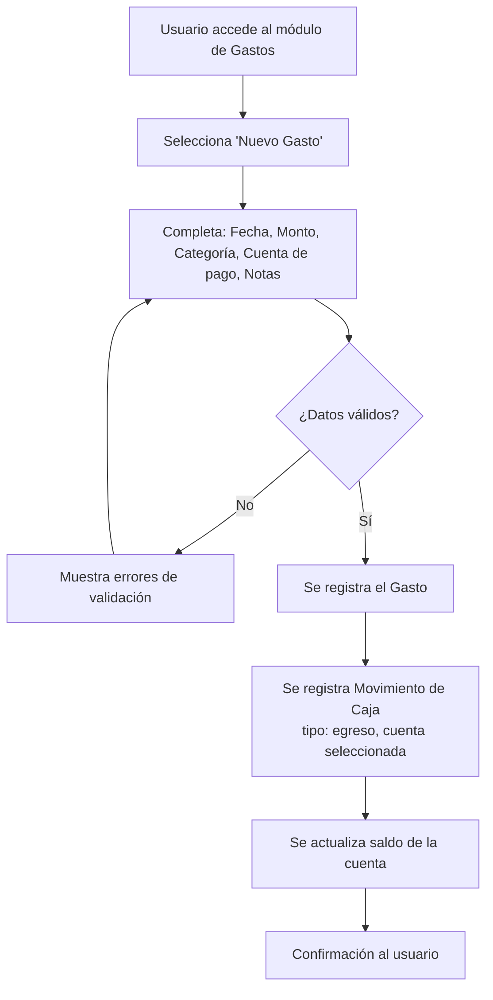
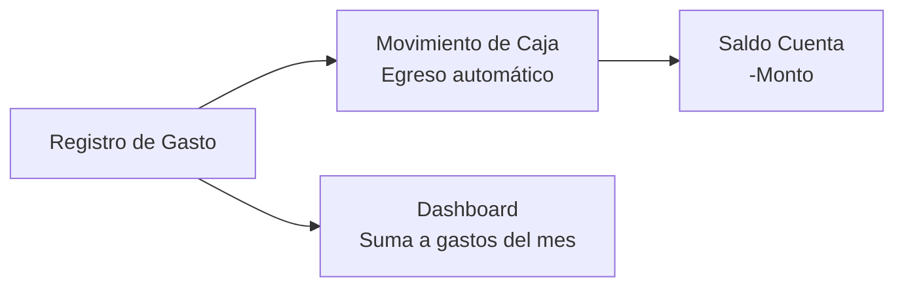
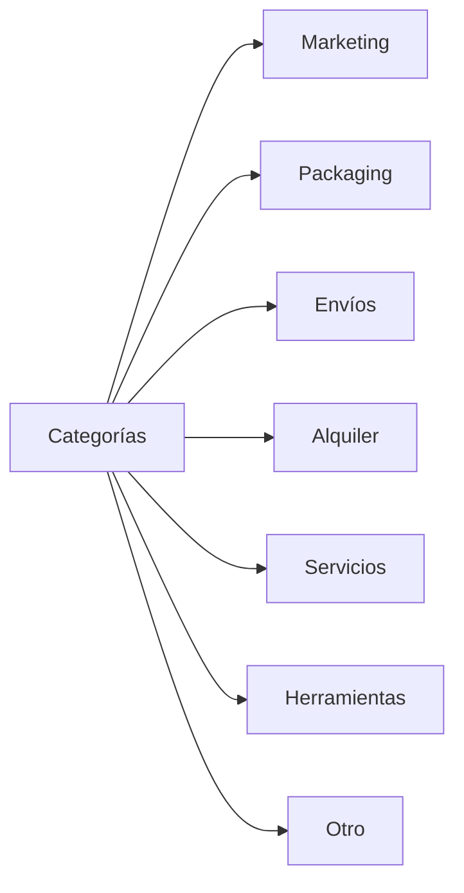

# Historia de Usuario 7: Registro de Gasto

## Descripción

Registra gastos no productivos del negocio (marketing, packaging, envíos, etc.), generando automáticamente un movimiento de caja.

## Actores

- Usuario (dueño/operador del negocio)

## Precondiciones

- Debe existir al menos una cuenta de caja.

## Flujo Principal



## Diagrama de Impacto



## Categorías de Gasto



## Ejemplo Concreto

> Se paga $2.000 por publicidad en Instagram.
>
> 1. Fecha: 28/04/2026
> 2. Monto: $2.000
> 3. Categoría: Marketing
> 4. Cuenta: Mercado Pago
> 5. Notas: "Promoción de velas para el Día de la Madre"
>
> **Impacto:**
> - Caja (Mercado Pago): egreso de $2.000
> - Dashboard mensual: +$2.000 en gastos de Marketing

## Reglas de Negocio

- El monto debe ser > 0.
- La categoría es obligatoria.
- La fecha es obligatoria.
- El movimiento de caja se genera automáticamente.
- Los gastos no afectan stock de ningún tipo.
- Los gastos se suman al total de gastos del mes para el dashboard.

## Vista de Gastos - Gráfico por Categoría

La sección de Gastos incluye un gráfico de **Gastos por categoría** que muestra la distribución del gasto en el período seleccionado (torta o barras).

```
┌──────────────────────────────────┐
│  Gastos por Categoría            │
│                                  │
│  ● Marketing: $3.000 (37.5%)    │
│  ● Packaging: $2.500 (31.3%)    │
│  ● Envíos: $1.500 (18.8%)      │
│  ● Otros: $1.000 (12.5%)       │
└──────────────────────────────────┘
```

## Entidades Involucradas

| Entidad | Acción |
|---|---|
| Gasto | Crear |
| Movimiento de Caja | Crear (egreso automático) |
| Cuenta de Caja | Actualizar saldo (-monto) |
