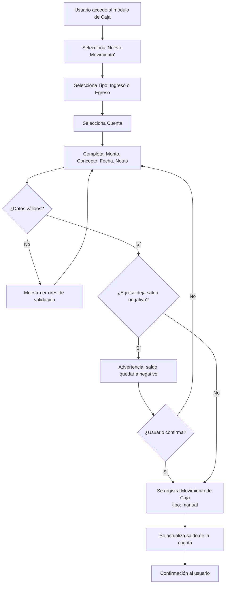
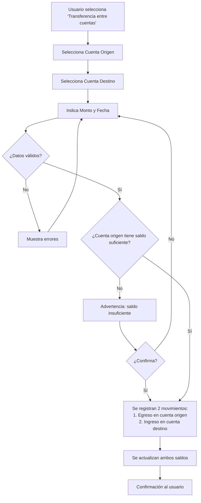
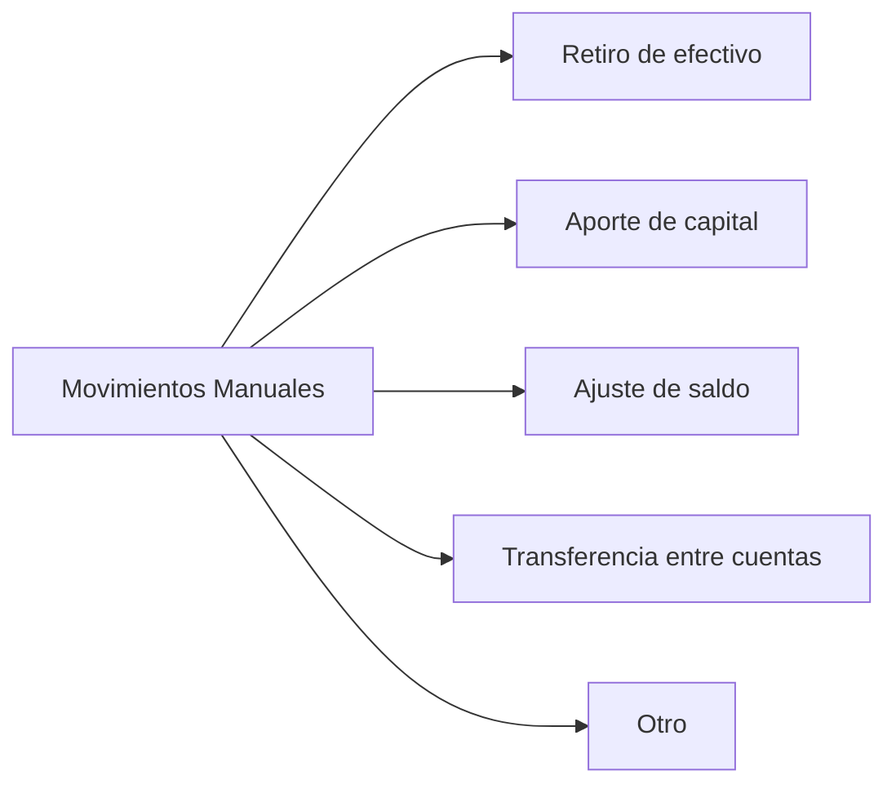

# Historia de Usuario 8: Movimiento Manual de Caja

## Descripción

Permite registrar movimientos de caja que no se generan automáticamente desde otros módulos: retiros de efectivo, ajustes, transferencias entre cuentas, aportes de capital, etc.

## Actores

- Usuario (dueño/operador del negocio)

## Precondiciones

- Debe existir al menos una cuenta de caja.

## Flujos

### 8a. Movimiento Simple (Ingreso o Egreso)

### 8b. Transferencia entre Cuentas

## Conceptos Comunes

## Ejemplo Concreto

> Se retiran $5.000 de la cuenta Banco para tener efectivo en la feria.
>
> 1. Transferencia: Banco → Efectivo, $5.000, 28/04/2026.
> 2. Movimiento 1: Banco, egreso, $5.000, concepto: "Retiro para feria".
> 3. Movimiento 2: Efectivo, ingreso, $5.000, concepto: "Retiro para feria".
> 4. Saldo Banco: -$5.000
> 5. Saldo Efectivo: +$5.000

## Reglas de Negocio

- El monto debe ser > 0.
- El concepto es obligatorio.
- Se permite saldo negativo con advertencia.
- Las transferencias generan dos movimientos vinculados.
- Los movimientos manuales se distinguen de los automáticos (tienen origen: "manual").
- No afectan stock ni otros módulos.

## Entidades Involucradas

| Entidad | Acción |
|---|---|
| Movimiento de Caja | Crear (manual) |
| Cuenta de Caja | Actualizar saldo |
