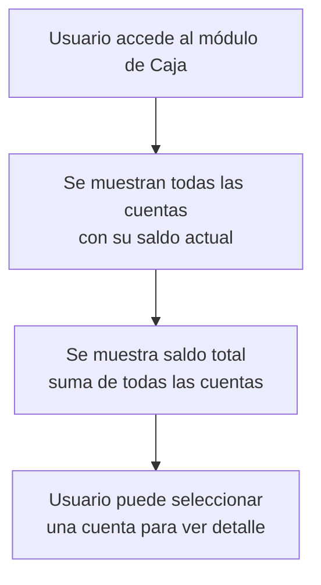
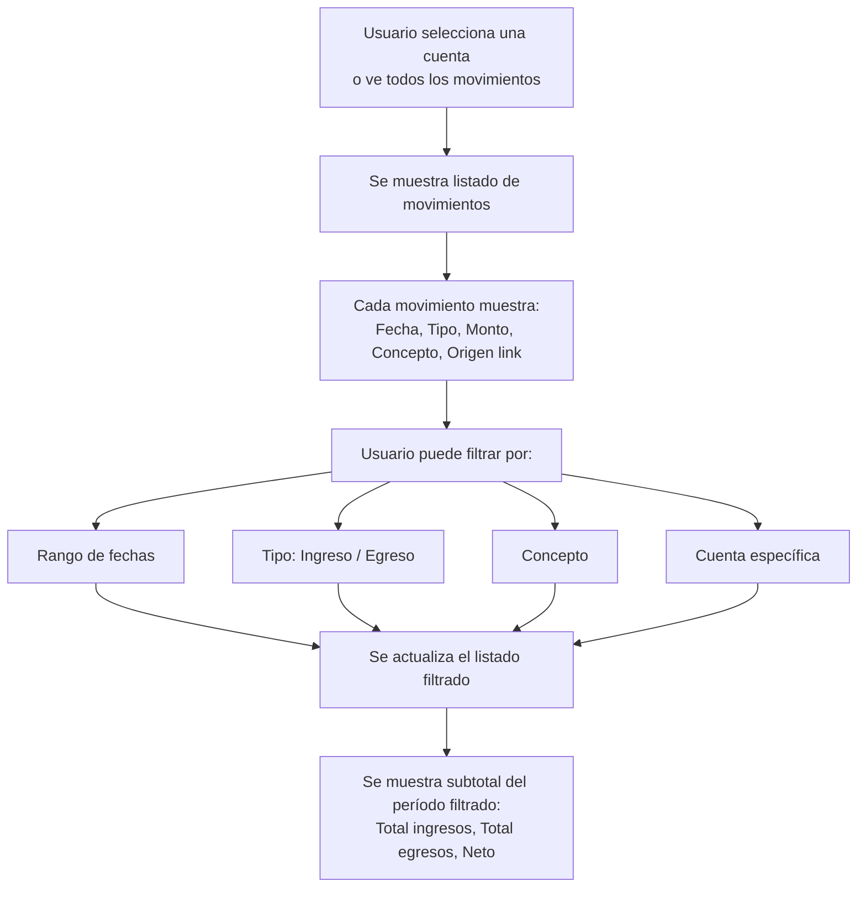
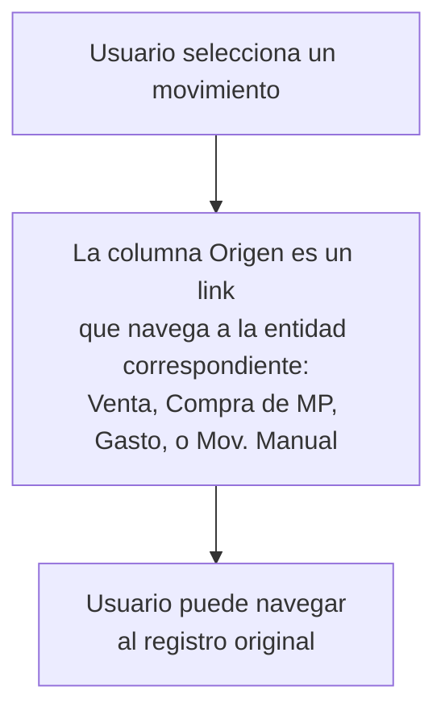

# Historia de Usuario 9: Consulta de Caja

## Descripción

Permite consultar el estado actual de las cuentas de caja y el historial de movimientos.

## Actores

- Usuario (dueño/operador del negocio)

## Precondiciones

- Deben existir cuentas de caja configuradas.

## Flujos

### 9a. Vista General de Caja

### 9b. Historial de Movimientos

### 9c. Detalle de Movimiento

## Ejemplo de Vista General

> **Caja - Resumen**
>
> | Cuenta | Saldo |
> |---|---|
> | Efectivo | $15.300 |
> | Banco | $42.000 |
> | Mercado Pago | $8.700 |
> | **Total** | **$66.000** |

## Ejemplo de Historial Filtrado

> **Movimientos - Abril 2026 - Efectivo**
>
> | Fecha | Tipo | Monto | Concepto | Origen |
> |---|---|---|---|---|
> | 28/04 | Ingreso | $9.300 | Venta | [Venta #42](link) |
> | 27/04 | Egreso | $5.000 | Compra MP | [Compra #15](link) |
> | 25/04 | Ingreso | $5.000 | Movimiento Manual | [Mov. Manual #3](link) |
> | 20/04 | Egreso | $1.500 | Compra MP | [Compra #14](link) |
>
> **Resumen:** Ingresos $14.300 | Egresos $6.500 | Neto +$7.800

## Conceptos de Movimiento (valores normalizados)

| Concepto | Descripción |
|---|---|
| Venta | Ingreso por venta de producto |
| Compra MP | Egreso por compra de materia prima |
| Gasto | Egreso por gasto operativo |
| Movimiento Manual | Ingreso o egreso registrado manualmente |

## Reglas de Negocio

- El saldo se calcula en tiempo real a partir de los movimientos.
- Los movimientos tienen referencia (link) a su entidad origen (venta, compra, gasto, movimiento manual).
- La columna "Origen" es un link navegable a la entidad que generó el movimiento.
- El campo "Concepto" es un valor normalizado (no texto libre); se usa como filtro y columna.
- El filtro de "Origen Automático/Manual" se elimina.
- El historial es de solo lectura (no se editan movimientos pasados).
- Se puede filtrar por múltiples criterios simultáneamente.

## Entidades Involucradas

| Entidad | Acción |
|---|---|
| Cuenta de Caja | Consultar saldo |
| Movimiento de Caja | Consultar / Filtrar |
