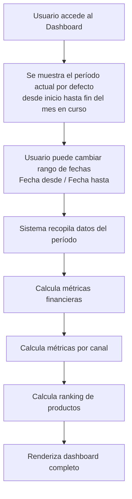
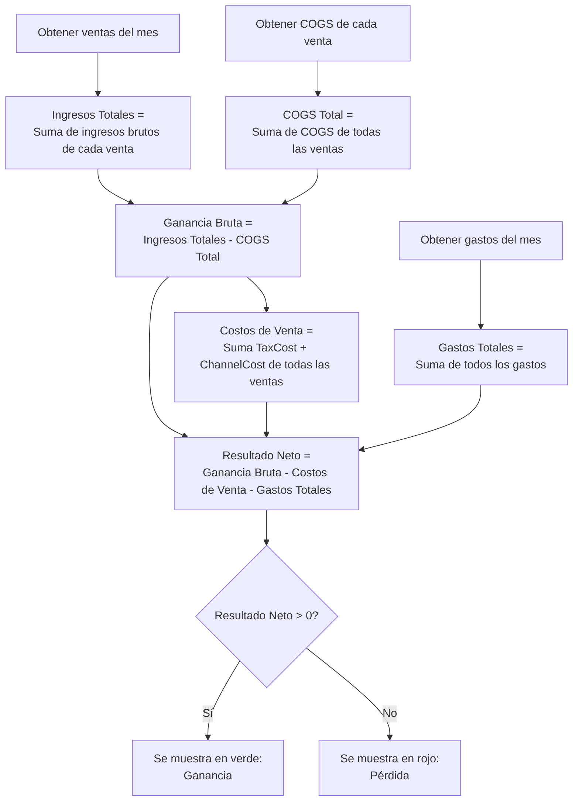
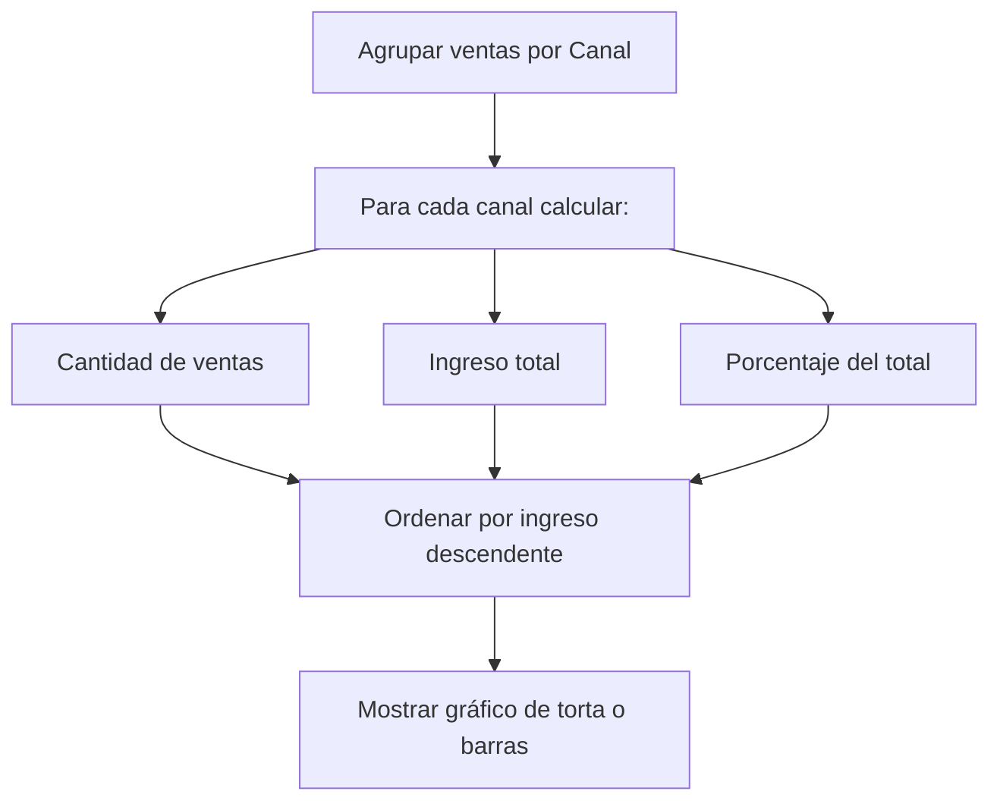
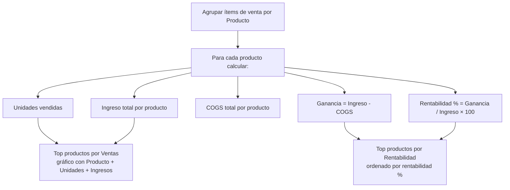

# Historia de Usuario 10: Dashboard Mensual

## Descripción

Vista principal del sistema que muestra las métricas financieras clave del negocio para un mes determinado, permitiendo responder las tres preguntas fundamentales: ¿Estoy ganando plata? ¿Qué productos son más rentables? ¿Vale la pena el tiempo invertido?

## Actores

- Usuario (dueño/operador del negocio)

## Precondiciones

- Deben existir registros de ventas, producción y/o gastos para el período consultado.

## Flujo Principal



## Cálculo de Métricas Financieras



## Métricas por Canal



## Ranking de Productos



## Layout del Dashboard

```
┌─────────────────────────────────────────────────────────┐
│  Dashboard                [Desde: 01/04/2026] [Hasta: 30/04/2026]  │
├─────────────┬──────────────┬──────────────┬─────────────┤
│  Ingresos   │    COGS      │  Costos Vta  │  Gastos     │
│  por Ventas │              │              │             │
│  $45.000    │   $22.000    │   $3.130     │  $8.000     │
├─────────────┴──────────────┴──────────────┴─────────────┤
│                                                         │
│  Ganancia Bruta: $23.000 (51.1%)                        │
│  Costos de Venta: $3.130 (TaxCost + ChannelCost)        │
│  Gastos Operativos: $8.000                              │
│  Resultado Neto: +$11.870 (26.4%)  ✅ Verde             │
│                                                         │
├──────────────────────────┬──────────────────────────────┤
│  Ventas por Canal        │  Top Productos por Ventas    │
│                          │  (gráfico)                   │
│  ● Feria: $20.000 (44%) │                              │
│  ● Instagram: $15.000   │  Producto     | Uds | Ingreso│
│  ● Tienda: $10.000      │  Vela Vainilla|  12 | $18.000│
│                          │  Vela Lavanda |   8 | $12.000│
├──────────────────────────┤  Vela Canela  |   5 | $8.000 │
│  Top Productos           │  Set Regalo   |   3 | $7.000 │
│  Rentabilidad            │                              │
│                          │                              │
│  1. Set Regalo    62.0%  │                              │
│  2. Vela Canela   55.0%  │                              │
│  3. Vela Vainilla 48.6%  │                              │
│  4. Vela Lavanda  45.0%  │                              │
└──────────────────────────┴──────────────────────────────┘
```

## Ejemplo Concreto

> **Dashboard - 01/04/2026 al 30/04/2026**
>
> | Métrica | Valor |
> |---|---|
> | Ingresos por Ventas | $45.000 |
> | COGS (costo de ventas realizadas) | $22.000 |
> | Ganancia Bruta | $23.000 |
> | Costos de Venta (Tax + Canal) | $3.130 |
> | Gastos Operativos | $8.000 |
> | **Resultado Neto** | **+$11.870** |
>
> **¿Estoy ganando plata?** → Sí, $11.870 netos en el período.
> **¿Qué producto conviene más?** → Set Regalo tiene mejor rentabilidad (62%).
> **¿Estamos cubriendo gastos?** → Sí, la ganancia bruta ($23.000) cubre costos de venta ($3.130) y gastos ($8.000) con margen.

## Reglas de Negocio

- El dashboard filtra por rango de fechas (fecha desde / fecha hasta), no por mes cerrado.
- Por defecto muestra el mes en curso (desde el 1° hasta hoy o fin de mes).
- "Ingresos" se refiere exclusivamente a ingresos por ventas.
- El COGS es el costo de las ventas realizadas en el período (no el gasto total en insumos/compras de MP).
- Todos los cálculos se basan en datos registrados (ventas, producción, gastos).
- Los gastos incluyen solo los del módulo Gastos (no compras de MP).
- El resultado neto es: Ingresos por Ventas - COGS - Costos de Venta (TaxCost + ChannelCost) - Gastos.
- Si no hay datos para el período, se muestra todo en $0.
- El panel "Gastos por categoría" NO se muestra en el dashboard (se muestra en la sección Gastos).
- "Top productos por ventas" se muestra como gráfico con columnas: Producto, Unidades, Ingresos.

## Entidades Involucradas

| Entidad | Acción |
|---|---|
| Venta / Ítems de Venta | Consultar (ingresos, COGS, canal, productos) |
| Gasto | Consultar (gastos por categoría) |
| Producción | Consultar (para COGS de productos) |
| Producto | Consultar (nombres, datos) |
