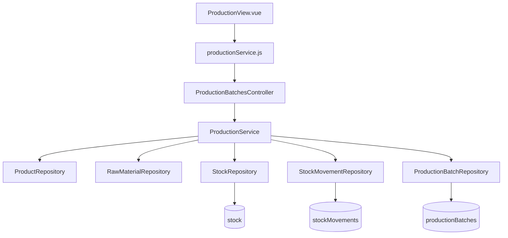
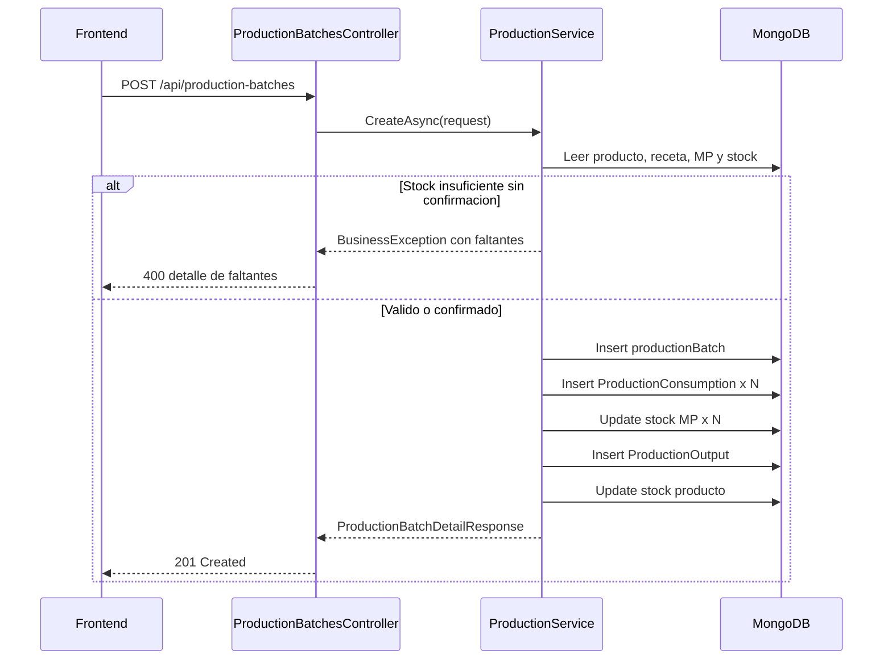

# Spec 08: Producción

## Descripción

Registrar tandas de producción, descontando MP del stock, calculando costo de producción (snapshot) y generando stock de producto terminado.

## Referencia

- US 05 (Producción).
- Correcciones: costo se calcula con `lastPricePerUnit` (no precio histórico por fecha), agregar filtros y KPIs.
- POC: `Analisis/POC/produccion.html`
- DER: colecciones `productionBatches`, `stock`, `stockMovements`.

## Colecciones del DER

- `productionBatches`
- `stock` (actualizar MP y Producto Terminado)
- `stockMovements` (crear ProductionConsumption × N + ProductionOutput × 1)
- `rawMaterials` (consultar `lastPricePerUnit`)
- `products` (consultar receta)

## Requerimientos

### R1: Registrar una tanda de producción

**Historia de usuario:** Como usuario operador, quiero registrar una tanda de producción de un producto terminado, para que el sistema descuente las materias primas consumidas y aumente el stock disponible del producto producido.

#### Criterios de aceptación

1. CUANDO el usuario registra una producción con producto, cantidad, fecha y notas opcionales, EL sistema DEBE crear una tanda en `productionBatches`.
2. SI el producto no existe, no está visible para operación o no tiene receta, EL sistema DEBE rechazar el registro con un error claro.
3. SI la cantidad producida es menor o igual a 0, EL sistema DEBE rechazar el registro.
4. CUANDO la producción se confirma, EL sistema DEBE calcular la cantidad requerida de cada MP como `recipe[i].quantity × cantidadProducida`.

### R2: Actualizar stock y movimientos de materias primas

**Historia de usuario:** Como usuario operador, quiero que la producción descuente automáticamente las materias primas de la receta, para mantener el inventario operativo actualizado.

#### Criterios de aceptación

1. CUANDO se registra una producción, EL sistema DEBE crear un `stockMovement` de tipo `ProductionConsumption` por cada ingrediente de la receta.
2. CADA movimiento `ProductionConsumption` DEBE usar `itemType = RawMaterial`, `quantity` negativa, `referenceType = Production` y `referenceId` de la tanda.
3. CUANDO se registra cada consumo, EL sistema DEBE actualizar el `stock.currentQuantity` de la MP descontando la cantidad requerida.
4. SI una o más MP tienen stock insuficiente, EL sistema DEBE informar el detalle de faltantes y permitir continuar con confirmación explícita.
5. SI el usuario continúa con stock insuficiente, EL sistema DEBE permitir que el stock de MP quede negativo.

### R3: Generar stock de producto terminado

**Historia de usuario:** Como usuario operador, quiero que la producción incremente automáticamente el stock del producto terminado, para que quede disponible para ventas.

#### Criterios de aceptación

1. CUANDO se registra una producción, EL sistema DEBE crear un `stockMovement` de tipo `ProductionOutput` para el producto terminado.
2. EL movimiento `ProductionOutput` DEBE usar `itemType = FinishedProduct`, `quantity` positiva, `referenceType = Production` y `referenceId` de la tanda.
3. CUANDO se registra la salida de producción, EL sistema DEBE incrementar el `stock.currentQuantity` del producto terminado por la cantidad producida.

### R4: Calcular y preservar el costo de producción

**Historia de usuario:** Como usuario dueño, quiero que cada tanda guarde el costo calculado al momento de producir, para conservar trazabilidad aunque luego cambien los precios de materias primas.

#### Criterios de aceptación

1. CUANDO se registra una producción, EL sistema DEBE calcular cada costo de ingrediente como `quantityUsed × rawMaterial.lastPricePerUnit`.
2. EL sistema DEBE guardar en `productionBatches.ingredients` el snapshot de `rawMaterialId`, `quantityUsed`, `pricePerUnit` y `cost`.
3. EL sistema DEBE calcular `totalCost` como la suma de costos de ingredientes.
4. EL sistema DEBE calcular `unitCost` como `totalCost / quantity`.
5. SI cambia `rawMaterials.lastPricePerUnit` después de crear la tanda, EL costo guardado de la tanda NO DEBE cambiar.
6. EL sistema NO DEBE buscar precios históricos por fecha para calcular el costo operativo de producción.

### R5: Consultar producciones con filtros, KPIs y detalle

**Historia de usuario:** Como usuario dueño u operador, quiero consultar las tandas registradas con filtros y resumen del período, para analizar producción y costos.

#### Criterios de aceptación

1. CUANDO el usuario consulta producciones, EL sistema DEBE listar fecha, producto, cantidad, costo total, costo unitario y notas.
2. EL listado DEBE permitir filtrar por producto y rango de fechas.
3. LOS KPIs del período filtrado DEBEN mostrar total de unidades producidas y costo total.
4. CUANDO el usuario abre una tanda, EL sistema DEBE mostrar el detalle de ingredientes usados, cantidades, precios unitarios snapshot y costos.

## Diseño

### Contexto de steering

Archivos consultados:

- `.kiro/steering/dotnet.md`
- `.kiro/steering/mongodb.md`
- `.kiro/steering/vue.md`
- `.kiro/steering/infraestructura.md`

Reglas relevantes para este diseño:

- Backend .NET por capas: `Kelas.Api`, `Kelas.Services`, `Kelas.Repositories`, `Kelas.Domain`.
- Controllers delgados con `[Authorize]`, sin lógica de negocio ni acceso a repositorios.
- Services con validaciones, reglas de negocio y mapeo manual entidad/DTO.
- Repositories como única capa de acceso a colecciones MongoDB, con filtros dinámicos usando `Builders<T>.Filter`.
- Colecciones MongoDB en camelCase plural, campos persistidos con `[BsonElement("camelCase")]` y documentos inmutables sin endpoints de update/delete.
- Consultas por lote con `$in` obligatorias cuando se necesitan múltiples documentos por id.
- Frontend Vue/Vite con Composition API, vistas por ruta, servicios HTTP por módulo y componentes comunes (`DataTable`, `AppModal`, `ConfirmDialog`; `KpiCard`/`FilterBar` si se agregan).
- MongoDB local requiere replica set para transacciones, ya contemplado en infraestructura.

Conflicto detectado:

- `dotnet.md` indica que `Kelas.Services` no debe usar acceso directo a MongoDB ni depender de `MongoDB.Driver`.
- El código actual (`PurchaseService`) ya coordina transacciones desde el service con `IMongoClient` y pasa `session` a repositorios. Para esta spec se mantiene ese patrón existente para consistencia operativa, pero el diseño evita uso de `IMongoDatabase` o colecciones directas dentro del service: toda lectura/escritura de datos debe pasar por repositorios.

### Arquitectura

La funcionalidad se implementa como un módulo de producción análogo a compras y ajustes de stock: controller REST, servicio de aplicación transaccional, repositorio Mongo, modelos request/response y pantalla Vue.

### Backend

#### Entidades y modelos

- Agregar `Kelas.Domain/Entities/ProductionBatch.cs` con:
  - `Id`
  - `ProductId`
  - `Quantity`
  - `Date`
  - `TotalCost`
  - `UnitCost`
  - `Ingredients: List<ProductionBatchIngredient>`
  - `Notes`
  - `CreatedAt`
- Agregar `ProductionBatchIngredient` embebido con:
  - `RawMaterialId`
  - `QuantityUsed`
  - `PricePerUnit`
  - `Cost`
- Agregar requests:
  - `CreateProductionBatchRequest`: `ProductId`, `Quantity`, `Date`, `Notes`, `ConfirmInsufficientStock`.
  - `GetProductionBatchesRequest` no es obligatorio; se puede resolver con query params en controller: `productId`, `dateFrom`, `dateTo`.
- Agregar responses:
  - `ProductionBatchListResponse`: `Id`, `ProductId`, `ProductName`, `Quantity`, `Date`, `TotalCost`, `UnitCost`, `Notes`.
  - `ProductionBatchDetailResponse`: datos de la tanda + ingredientes con `RawMaterialName`, `QuantityUsed`, `PricePerUnit`, `Cost`.
  - `ProductionBatchListResultResponse`: `Items`, `Kpis`.
  - `ProductionKpisResponse`: `TotalUnitsProduced`, `TotalCost`.
  - `InsufficientStockWarningResponse` o campo `Warning` en la respuesta de creación, con faltantes si se continuó pese a insuficiencia.

#### Repositorio

Crear `IProductionBatchRepository` y `ProductionBatchRepository`.

Métodos previstos:

- `CreateAsync(ProductionBatch entity, object? session = null)`
- `GetByIdAsync(string id)`
- `GetAsync(string? productId, DateTime? dateFrom, DateTime? dateTo)`
- `EnsureIndexesAsync()`

Índices:

- `{ productId: 1, date: -1 }`
- `{ date: -1 }`

Extender repositorios existentes para evitar N queries:

- `IProductRepository.GetByIdsAsync(IEnumerable<ObjectId> ids)` sólo si el detalle/listado lo necesita en lote; para crear una tanda alcanza `GetByIdAsync`.
- `IRawMaterialRepository.GetByIdsAsync(IEnumerable<ObjectId> ids)` ya existe y debe usarse para cargar las MP de la receta en una sola consulta.
- `IStockRepository.GetByItemsAsync(string itemType, IEnumerable<ObjectId> itemIds)` para cargar stock de todas las MP en una sola consulta.
- `IStockRepository.IncrementQuantityAsync(...)` debe actualizar `lastUpdated`; si se decide crear stock on-demand, agregar un método explícito de upsert en el repositorio en vez de acceder a la colección desde el service.

#### Servicio

Crear `IProductionService` y `ProductionService`.

`CreateAsync(CreateProductionBatchRequest request)` debe ejecutar una transacción única para que tanda, movimientos y stock queden consistentes. El service coordina la transacción siguiendo el patrón actual de `PurchaseService`, pero no debe usar `IMongoDatabase` ni `GetCollection`; todo acceso a datos queda encapsulado en repositorios.

Flujo de creación:

1. Validar `Quantity > 0` y fecha obligatoria.
2. Buscar producto por `ProductId`; rechazar si no existe, no visible o no tiene receta.
3. Cargar las MP de la receta con `IRawMaterialRepository.GetByIdsAsync(...)` en una sola consulta.
4. Cargar los stocks actuales de todas las MP con `IStockRepository.GetByItemsAsync(...)` en una sola consulta.
5. Calcular `quantityUsed = recipe.quantity × request.Quantity` por ingrediente.
6. Detectar faltantes comparando `quantityUsed` contra `stock.currentQuantity` o 0 si no hay documento de stock.
7. Si hay faltantes y `ConfirmInsufficientStock` no es `true`, devolver error de negocio con detalle de faltantes para que el frontend pida confirmación.
8. Calcular snapshot de ingredientes con `rawMaterial.lastPricePerUnit`, `cost`, `totalCost` y `unitCost`.
9. Crear `ProductionBatch`.
10. Crear un `StockMovement` `ProductionConsumption` por ingrediente:
   - `ItemType = RawMaterial`
   - `ItemId = rawMaterial.Id`
   - `Quantity = -quantityUsed`
   - `ReferenceType = Production`
   - `ReferenceId = productionBatch.Id`
11. Decrementar stock de cada MP con `StockRepository.IncrementQuantityAsync(..., -quantityUsed, session)`.
12. Crear un `StockMovement` `ProductionOutput`:
   - `ItemType = FinishedProduct`
   - `ItemId = product.Id`
   - `Quantity = request.Quantity`
   - `ReferenceType = Production`
   - `ReferenceId = productionBatch.Id`
13. Incrementar stock del producto terminado con `StockRepository.IncrementQuantityAsync("FinishedProduct", ...)`.
14. Confirmar transacción y devolver respuesta con resumen de costos.

#### API

Crear `ProductionBatchesController` con `[Authorize]` y ruta `api/production-batches`.

- `POST /api/production-batches`: crea tanda.
- `GET /api/production-batches?productId=&dateFrom=&dateTo=`: lista tandas y KPIs del período filtrado.
- `GET /api/production-batches/{id}`: detalle.

Los errores de validación funcional deben usar `BusinessException` para integrarse con el middleware actual de errores.

### Frontend

Agregar módulo de producción:

- `kelas-frontend/src/services/productionService.js`
- `kelas-frontend/src/views/ProductionView.vue`
- `kelas-frontend/src/components/production/ProductionFormModal.vue`
- `kelas-frontend/src/components/production/ProductionDetailModal.vue` si el detalle no entra cómodamente en la vista.
- Ruta `/production` en `router/index.js`.
- Entrada "Producción" en `AppSidebar.vue`.

La vista debe seguir el patrón visual de `ProductsView.vue` y `RawMaterialsView.vue`:

- Header con título y botón "Nueva Producción".
- Filtros por producto y rango de fechas.
- KPIs arriba de la tabla: "Unidades Producidas" y "Costo Total".
- Tabla con fecha, producto, cantidad, costo total, costo unitario y notas.
- Modal de alta con producto, cantidad, fecha y notas.
- Si el backend responde faltantes, mostrar confirmación con detalle `MP`, `necesario`, `disponible` y `faltante`; al confirmar, reintentar con `confirmInsufficientStock: true`.

### Datos y consistencia

- `productionBatches` es inmutable después de creado.
- `productionBatches.ingredients` conserva snapshot de cantidades, precios y costos.
- `stockMovements` creados por producción deben tener `ReferenceType = Production` para trazabilidad.
- La creación debe ser transaccional. Si falla cualquier inserción o actualización, no debe quedar tanda parcial.
- El diseño asume que existe un documento `stock` para cada producto terminado creado por Spec 07. Para MP sin documento de stock se debe tratar disponibilidad como 0; si se confirma producción insuficiente, el incremento/decremento debe operar sobre el documento existente o crear uno si el repositorio actual no garantiza existencia.
- Las lecturas de materias primas y stock para recetas deben ser por lote. No se deben hacer queries individuales dentro de un loop por ingrediente.

### Testing

Tests de integración esperados en `Kelas.Tests`:

- Producción exitosa: crea tanda, consume MP, incrementa producto terminado, movimientos correctos y costo correcto.
- Producción con stock insuficiente sin confirmación: devuelve error con faltantes y no modifica stock.
- Producción con stock insuficiente confirmada: crea tanda y permite stock negativo.
- Producto sin receta: error.
- Cantidad 0: error.
- Snapshot de costo: al cambiar `lastPricePerUnit` luego de producir, el costo de la tanda no cambia.
- Listado con filtro por producto y fechas.
- KPIs del período filtrado.

### Riesgos y decisiones pendientes

- El repositorio actual de stock incrementa documentos existentes; si falta un documento de stock, el diseño debe decidir entre crear on-demand o fallar. Para producción, se recomienda crear on-demand sólo para stock faltante de MP cuando se confirma insuficiencia, y mantener la inicialización de producto terminado desde Spec 07.
- La respuesta de error con faltantes debe tener un contrato estable para que el frontend pueda renderizar confirmación sin parsear texto.
- El listado no define paginación todavía; se mantiene fuera del MVP de esta spec para respetar el alcance actual.

## Alcance

### Backend

- **Endpoints**:
  - `POST /api/production-batches` — registrar producción.
  - `GET /api/production-batches` — listar con filtros (producto, rango de fechas). Incluir KPIs del período.
  - `GET /api/production-batches/:id` — detalle de una tanda.
- **Servicio**: `ProductionService`.
- **Repositorio**: `ProductionBatchRepository`.
- **Flujo al registrar producción**:
  1. Validar (producto existe, tiene receta, cantidad > 0).
  2. Calcular MP necesaria: `receta[i].quantity × cantidadProducida`.
  3. Verificar stock de cada MP (advertencia si insuficiente, no bloquear).
  4. Para cada ingrediente:
     - Crear `stockMovement` (ProductionConsumption, -cantidad).
     - Actualizar `stock` de la MP.
  5. Calcular costo: `ingrediente.quantity × rawMaterial.lastPricePerUnit` → snapshot en `ingredients`.
  6. Calcular `totalCost` y `unitCost`.
  7. Crear `stockMovement` (ProductionOutput, +cantidadProducida).
  8. Actualizar `stock` de Producto Terminado.
  9. Guardar `productionBatch` con snapshot de ingredientes.
- **KPIs del período**: Total unidades producidas, Costo total.

### Frontend

- **Pantalla**: Listado de producciones con tabla.
- **KPIs**: Cards con "Unidades Producidas" y "Costo Total" del período filtrado.
- **Filtros**: Por producto, rango de fechas.
- **Columnas**: Fecha, Producto, Cantidad, Costo Total, Costo Unitario, Notas.
- **Modal de nueva producción**: Producto (select), Cantidad, Fecha, Notas.
- **Advertencia**: Si stock de MP insuficiente, mostrar detalle de faltantes con opción de continuar.

## Criterios de Aceptación

- [ ] Se registra la producción correctamente.
- [ ] El stock de cada MP se reduce según receta × cantidad.
- [ ] El stock de producto terminado se incrementa.
- [ ] Se crean StockMovements correctos (N consumos + 1 output).
- [ ] El costo se calcula con `lastPricePerUnit` actual.
- [ ] El snapshot de ingredientes queda inmutable.
- [ ] Se permite producir con stock insuficiente (con advertencia).
- [ ] Los filtros y KPIs funcionan.

## Tests de Integración Esperados

- Test producción exitosa → stocks actualizados, movimientos creados, costo calculado.
- Test producción con stock insuficiente → se permite, stocks pueden quedar negativos.
- Test producto sin receta → error.
- Test cantidad 0 → error.
- Test costo snapshot: cambiar precio de MP después de producir → costo de la tanda no cambia.
- Test KPIs del período.
- Test filtro por producto y por fechas.
